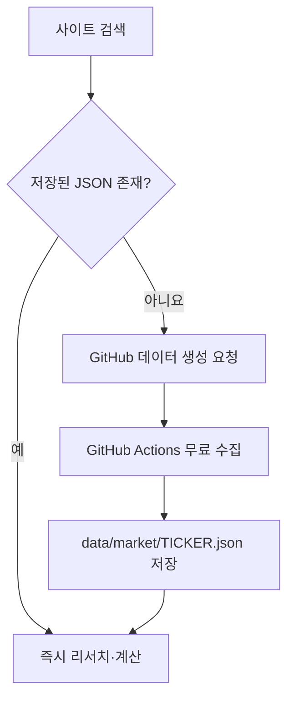

# Signal (구 MyQuantPlatform)

유료 시장 데이터 API 키 없이 종목·ETF를 검색하고, 종합점수·AI요약·적정가·포트폴리오 진단·리스크 시나리오·백테스트·리밸런싱·투자 일지까지 한 화면에서 관리하는 GitHub Pages 웹앱입니다. 저장소 이름은 `MyQuantPlatform`이지만 사이트 브랜드는 `Signal`입니다.

## 바로 사용하기

1. GitHub Pages에서 `my-portfolio_5.html`을 엽니다(더블클릭 `file://`가 아니라 반드시 `https://...` 주소로 접속 — 아래 "알려진 제한사항" 참고).
2. 회사명 또는 티커를 검색합니다(입력하는 즉시 실시간으로 결과가 갱신됩니다).
3. 상세 데이터가 이미 저장된 종목은 즉시 리서치가 열립니다.
4. 처음 보는 티커라면 `무료 데이터 생성 요청`을 누르고 GitHub 이슈를 등록합니다.
5. GitHub Actions와 Pages 반영을 1~3분 기다린 뒤 사이트에서 다시 검색합니다.

API 키 입력, 유료 구독, 로컬 프로그램 설치는 필요하지 않습니다. 한 번 생성된 티커 파일은 검색·백테스트·비교·ETF X-ray·종합점수·적정가 계산에서 반복 사용됩니다.

## 무료 데이터 구조



- 브라우저는 Twelve Data나 FMP 같은 유료 API를 호출하지 않습니다.
- `scripts/build_market_cache.py`가 공개 Nasdaq.com 시장 페이지를 한 번 읽고 정규화된 JSON을 만듭니다. `api.nasdaq.com`은 GitHub Actions 실행 환경에서만 접근 가능하며, 로컬 샌드박스 등 외부에서 직접 실행하면 403으로 차단될 수 있습니다.
- `.github/workflows/update-market-data.yml`이 평일마다 기존 캐시를 갱신합니다.
- 일시적인 공급처 오류가 발생해도 기존 정상 캐시 파일은 지우지 않습니다.
- 공개 저장소의 표준 GitHub Actions 실행 시간은 무료지만, GitHub 정책·공급처 페이지 구조는 향후 바뀔 수 있습니다.

## 기본 제공 캐시

다음 티커는 거래량과 무관하게 항상 검색 가능한 기본 캐시 목록(`data/default-tickers.json`)입니다.

`AAPL, MSFT, NVDA, GOOGL, AMZN, META, TSLA, AVGO, AMD, PLTR, SPY, VOO, QQQ, QQQM, VTI, VT, IVV, SCHD, SOXX, SOXQ, SMH, XLK, VGT, IWM, DIA, BND, TLT, GLD, SPMO, QLD, VUG, SCHQ`

이 중 **SPMO, QLD, VUG, SCHQ 4개는 목록에만 등록되어 있고 아직 상세 데이터 파일이 생성되지 않았습니다.** GitHub `Actions` → `Update free market data` → `Run workflow` → `tickers`에 `SPMO,QLD,VUG,SCHQ` 입력 후 실행하면 생성되며, 이후에는 평일 자동 갱신 대상에 자연히 포함됩니다.

검색용 `data/catalog.json`에는 미국 주식·ETF 약 12,300개가 들어 있으며, 상세 데이터는 필요한 티커만 생성해 저장소 용량을 관리합니다.

## 새로 추가된 기능

기존 포트폴리오·백테스트·ETF 엑스레이·투자일지 기능에 더해 다음이 추가되었습니다. 모두 저장된 무료 캐시 데이터만으로 계산하며 추가 API 호출이 없습니다.

- **검색 품질 개선**: 실시간(입력 중) 검색, 시가총액·거래량·이 브라우저에서의 검색 빈도를 종합한 랭킹, 사전 구축 인덱스로 속도 개선
- **기업 종합점수(100점)**: 성장성·수익성·재무건전성·밸류에이션·모멘텀 5개 축(ETF는 비용·규모·분배수익률·모멘텀)
- **AI 기업요약**: 강점·약점·리스크를 규칙 기반으로 요약 (아래 "AI 기능 구조" 참고)
- **경제적 해자 분석**: 마진 수준·안정성·규모를 대리 지표로 한 1~5점 평가
- **AI 적정가(PER·PEG·FCF·DCF)**: EPS 배수법 + 2단계 FCF 할인모형(DCF), 목표 PER·성장률·할인율을 직접 조정 가능
- **최근 실적 서프라이즈**: 저장된 분기 실제/예상 EPS로 상회·하회율 표시(※ 미래 실적 발표 "일정"은 미구현 — 아래 제한사항 참고)
- **포트폴리오 진단**: AI·반도체·빅테크 테마 노출, 국가 비중, 섹터/ETF 중복은 기존 X-ray와 로직 공유
- **리스크 시나리오 시뮬레이션**: "AI -30%", "반도체 -20%", "금리 +1%p", "시장 전체 -10%" 등 단순화된 스트레스 테스트
- **AI 포트폴리오 코치**: 위 진단 결과를 규칙 기반 조언 문장으로 정리
- **종목 비교 업그레이드**: 기존 가격 성과·상관관계 비교에 PER·PBR·PSR·ROE·영업이익률·순이익률·총부채·잉여현금흐름·순이익 CAGR 비교표 추가
- **배당 계산기**: 저장된 배당수익률 기준 연/월 배당액과 배당 성장 시나리오
- **관심종목(Watchlist)**: 리서치 화면에서 추가/삭제, 이 브라우저에만 저장
- **오늘의 시장 시그널**: 실시간 뉴스가 아니라 기본 캐시 종목들의 최근 저장일 등락을 규칙 기반으로 요약(AI 뉴스요약의 무료 대체)
- **투자일지 업그레이드**: 목표가·매수일 입력, 매수 후 6개월/1년(또는 설정한 검토일)이 지나면 자동으로 "복기" 알림 표시

## AI 기능 구조 (규칙 기반 → 실제 LLM으로 교체 가능한 설계)

`AI 기업요약 / AI 포트폴리오 코치 / 오늘의 시장 시그널`은 지금은 외부 API 없이 규칙 기반으로 동작하지만, 나중에 OpenAI·Claude·Gemini 등을 연결할 때 UI나 캐시 구조를 다시 만들 필요가 없도록 어댑터 형태로 설계했습니다(`my-portfolio_5.html` 안 "AI 인터페이스 어댑터" 섹션).

- `AI_PROVIDERS` 객체에 provider를 하나 추가(`generate(kind, prompt, context)`가 표준 스키마를 반환)하고 `activeAiProvider`만 바꾸면 즉시 전체 UI가 전환됩니다.
- `buildAiPrompt(kind, context)`가 실제 LLM에 그대로 보낼 수 있는 프롬프트(지시문 + JSON 데이터)를 이미 구성해 둡니다.
- 응답은 항상 `{oneLiner, summary, bullets:{strengths,weaknesses,risks}, score}` 형태이며, 캐시는 `localStorage`에 데이터 지문(fingerprint)과 함께 저장되어 원본 데이터가 바뀌면 자동으로 무효화됩니다.
- 현재는 무료 원칙 유지를 위해 `rule-based` provider만 실제로 켜져 있습니다. 실 API 키가 필요한 LLM 연결은 사용자가 직접 provider를 추가해야 하며, 이 저장소만으로는 여전히 무료·키 불필요 상태입니다.

## 테스트

세 단계로 검증합니다.

```bash
node scripts/validate_app.mjs      # 정적 검사: 문법, 중복 id, 인라인 핸들러 존재, 유료 API 미사용
python3 scripts/validate_cache.py  # data/ 폴더 무결성: 상세 캐시 200일 이상 이력, manifest 일치
npm install jsdom                  # 최초 1회만
node scripts/runtime_smoke_test.mjs # 런타임 회귀 테스트: 검색→리서치→포트폴리오→백테스트→비교→진단→배당→관심종목→일지→저장까지 실제 실행
```

`runtime_smoke_test.mjs`는 jsdom으로 앱을 실제로 구동시켜 검색, 종합점수/AI요약/해자/적정가, 포트폴리오 추가, 백테스트, 종목비교, ETF 엑스레이, 포트폴리오 진단, 적립식 시뮬레이션, 배당 계산기, 관심종목, 오늘의 시장 시그널, 투자일지(복기 알림 포함), 저장/복원까지 17개 시나리오를 실행해 런타임 오류가 없는지 확인합니다. 실제 네트워크 호출 없이 `data/` 폴더의 캐시 파일만 사용합니다.

## 알려진 제한사항 (정직하게 밝히는 미구현 항목)

- **실적 발표 "예정" 캘린더는 없습니다.** 과거 분기 실제/예상 EPS 서프라이즈만 표시하며, 미래 발표일은 무료 데이터 소스에서 구하지 못해 제공하지 않습니다.
- **적립식 계산기의 "복리 그래프" 시각화는 아직 텍스트/표 형태입니다.** 꺾은선 그래프 등 시각화는 추가되지 않았습니다.
- **ETF 중복분석은 텍스트·표로만 제공되며, 도넛 차트 등 시각화는 아직 없습니다.**
- **전체 UI를 토스증권/TradingView/Simply Wall St 수준으로 재구성하는 작업은 하지 않았습니다.** 파비콘(Signal 로고)과 브랜드 컬러만 반영했고, 레이아웃·타이포그래피 전면 개편은 남아 있습니다.
- **SPMO/QLD/VUG/SCHQ의 실제 상세 데이터는 이 저장소 상태만으로는 아직 없습니다.** 위 "기본 제공 캐시" 안내대로 GitHub Actions를 한 번 실행해야 합니다.
- **AI 기업요약/코치/시장 시그널은 실제 생성형 AI가 아니라 규칙 기반 로직입니다.** "AI 기능 구조" 절의 어댑터를 통해 나중에 실제 LLM으로 교체할 수 있도록 설계만 되어 있습니다.

이 목록에 없는 기능은 위 "새로 추가된 기능"과 기존 기능 모두 `runtime_smoke_test.mjs` 기준으로 정상 동작을 확인했습니다.

## 리서치 데이터

개별 주식에서 제공 가능한 항목:

- 현재가·시가총액·거래량·52주 최고/최저
- PER(최근 제공 4개 분기 EPS 기준), PBR·PSR(최근 연차 기준)
- EPS·ROE·매출총이익률·영업이익률·순이익률
- 총부채·현금 및 단기투자·자산·부채·자본·잉여현금흐름
- 최근 4개년 매출·영업이익·순이익·현금흐름 추이
- 1개월·3개월·6개월·1년 수익률 및 구간 최고/최저
- 애널리스트 평균·상단·하단 목표가와 매수·보유·매도 의견 수
- 회사 설명·섹터·산업·원본 출처·데이터 기준일

ETF에서 제공 가능한 항목:

- 가격·AUM·총보수·배당수익률·변동 관련 정보
- 공개된 상위 보유종목과 각 종목 비중
- 상위 보유종목을 이용한 섹터 노출과 ETF 간 중복률
- 상위 구성의 합계 비중을 표시해 전체 보유종목으로 오인하지 않도록 방지

ETF에는 기업 단위 PER·PBR·ROE가 없는 것이 정상입니다. 공급처가 특정 필드를 제공하지 않으면 앱은 추정하거나 꾸며내지 않고 `-` 또는 `정보 없음`으로 표시합니다.

## 포트폴리오 기능

- 계획 포트폴리오와 실제 보유 포트폴리오 분리
- KRW·USD 통합 평가와 잘못된 통화 단위 손익 차단
- 1·3·5·10년 백테스트와 정확한 날짜 필터
- 변동성·MDD·누적수익률·CAGR·베타·Sharpe·Sortino
- 종목 간 상관관계와 최대 4개 종목 비교
- ETF 상위 구성 기반 실질 노출·섹터 집중·중복 진단
- 추가 투자금·허용오차·수수료·소수점 거래를 반영한 리밸런싱
- 적립식 투자와 일시투자 비교
- 목표자산 도달 보수·기준·낙관 시나리오
- 매수 이유·위험·매도 조건·목표가·매수일·검토일·날짜별 투자 일지, 매수 후 6개월/1년 자동 복기 알림

이 외 종합점수·AI요약·적정가·테마노출·리스크시나리오·배당계산기·관심종목 등은 위 "새로 추가된 기능"을 참고하세요.

## 저장 방식 · Google 로그인

로그인하지 않으면 이 브라우저의 `기본 로컬 보관함`에만 저장됩니다(기기 간 자동 동기화 없음).

`09 Google 로그인 · 클라우드 저장` 카드에서 Google 계정으로 로그인하면 Firebase 인증 + Firestore로 포트폴리오·투자 일지가 사용자별로 분리 저장되며, 같은 계정으로 다른 기기에서 로그인해도 동일한 데이터가 열립니다. 로그아웃하면 다시 이 브라우저의 로컬 보관함으로 돌아갑니다.

Google 로그인 데이터는 Firestore 보안 규칙으로 사용자별로 분리되지만, 이 앱은 여전히 무료 정적 사이트이므로 브라우저 데이터 손상이나 계정 문제에 대비해 `JSON 백업` 버튼으로 정기 백업을 권장합니다. Firebase 프로젝트를 직접 배포하는 경우 `firebase-config.js`에 자신의 Firebase 프로젝트 설정을 넣고, Firebase 콘솔의 승인된 도메인에 배포 주소를 추가해야 로그인이 동작합니다.

## 데이터 생성과 수동 갱신

- 사이트에서 처음 보는 티커 검색 → `무료 데이터 생성 요청` → GitHub 이슈 등록
- 또는 GitHub `Actions` → `Update free market data` → `Run workflow` → 티커 입력
- 입력을 비우고 실행하면 이미 저장된 모든 티커를 갱신합니다.

이슈를 통한 생성은 저장소 소유자가 등록한 `[data] TICKER` 요청만 실행되므로 외부 사용자가 수집 작업을 남용할 수 없습니다.

## 데이터 정확도 안내

시장 가격은 공개 페이지의 지연 데이터이며 실시간 주문용이 아닙니다. 재무 수치는 최근 제공된 연차 자료, 애널리스트 값은 의견 집계입니다. 수치마다 기준일과 출처 링크를 표시하며, 이 앱의 결과는 학습·연구용이고 수익을 보장하지 않습니다.
