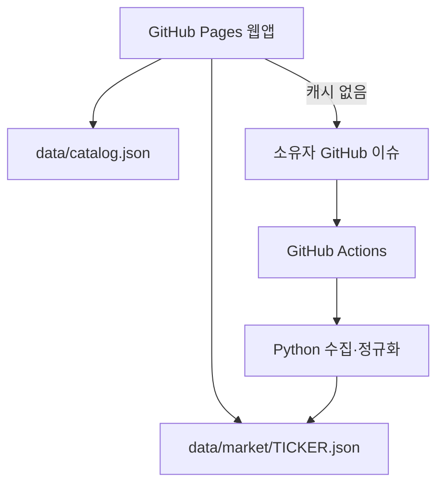

# MyQuantPlatform 2차 설계 문서

## 1. 제품 목표

MyQuantPlatform은 세 가지 질문을 한 화면에서 연결한다.

1. 이 회사 또는 ETF는 무엇이며 재무·가치·가격 상태는 어떤가?
2. 여러 종목을 함께 보유할 때 실제로 분산됐는가?
3. 목표 비중으로 옮기려면 무엇을 얼마만큼 사고팔아야 하는가?

UI 골격은 기존 단일 HTML 앱을 유지하고, 데이터 계층만 유료 API 직접 호출에서 무료 정적 캐시 구조로 교체한다.

## 2. 무료 데이터 아키텍처



### 프론트엔드

- 외부 유료 API 또는 사용자 API 키를 호출하지 않는다.
- 검색은 `data/catalog.json`만 사용한다.
- 리서치·가격·ETF 구성은 종목별 정적 JSON만 읽는다.
- 캐시 누락 시 `[data] TICKER` GitHub 이슈 생성 링크를 제공한다.
- 가격 수익률, 상관관계, 위험 지표, 리밸런싱은 브라우저에서 직접 계산한다.

### 수집기

- `scripts/build_market_cache.py`
- 공개 Nasdaq.com 시장 페이지의 구조화된 데이터를 서버 측에서 1회 수집한다.
- 10년 일별 가격, 회사 설명, 연차 재무, EPS, 애널리스트 집계, ETF 상위 보유종목을 정규화한다.
- 일시 실패한 종목은 기존 JSON을 유지한다.
- 숫자 단위를 USD·비율·퍼센트포인트로 명시적으로 분리한다.

### 자동화

- `.github/workflows/update-market-data.yml`
- 평일 하루 한 번 기존 캐시 갱신
- 월요일 검색 카탈로그 갱신
- 수동 티커 입력 지원
- 저장소 소유자가 연 `[data]` 이슈만 처리
- `contents: write`, `issues: write` 최소 권한

## 3. 종목 JSON 계약

```text
schemaVersion
symbol, name, type, exchange, currency
sector, industry, description, website
updatedAt, dataDate
quote
valuation
profitability
financialHealth
earnings
analyst
periods
financials.years
etf
history
sources
```

핵심 규칙:

- `quote.price`, 재무 금액: 실제 USD 값
- `profitability.*`, `quote.dividendYield`, `quote.expenseRatio`: 0~1 비율
- `etf.topHoldings[].weight`: 0~100 퍼센트포인트
- `history.dates`와 각 가격 배열: 동일 길이, 오래된 날짜부터 정렬
- 제공되지 않은 값: `null`; 임의 추정 금지

## 4. 리서치 계산 정의

| 지표 | 계산/기준 |
|---|---|
| PER | 현재가 ÷ 최근 제공된 4개 분기 EPS 합계 |
| PBR | 현재 시가총액 ÷ 최근 연차 자본 |
| PSR | 현재 시가총액 ÷ 최근 연차 매출 |
| ROE | 공급처 최근 연차 After Tax ROE |
| 영업이익률 | 최근 연차 영업이익 ÷ 매출 |
| 순이익률 | 최근 연차 순이익 ÷ 매출 |
| 총현금 | 현금및현금성자산 + 단기투자 |
| 총부채 | 단기차입금 + 장기부채 |
| 잉여현금흐름 | 영업현금흐름 − 자본적지출 절댓값 |
| 기간수익률 | 구간 마지막 종가 ÷ 첫 종가 − 1 |

PER·PBR·PSR의 분모 기준이 서로 다를 수 있으므로 UI에서 `최근 4분기` 또는 `최근 연차`를 표시한다.

## 5. ETF X-ray 정의

공개 페이지가 제공하는 상위 구성종목만 사용한다.

- 실질 종목 노출 = 포트폴리오 ETF 비중 × ETF 내 종목 비중
- ETF 간 중복률 = 공통 종목별 두 ETF 비중의 최솟값 합계
- 실질 섹터 노출 = 포트폴리오 ETF 비중 × 공개 상위 구성의 섹터 비중
- 직접 보유 주식 = 해당 티커 직접 노출

`holdingsCoverage`를 항상 표시한다. 예를 들어 44.75%이면 ETF 전체가 아니라 상위 구성 44.75%만 펼친 결과임을 뜻한다. 채권·원자재 ETF처럼 주식 보유종목이 제공되지 않으면 ETF 자체 노출로 유지한다.

## 6. 저장 방식 (로컬 기본 + Google 로그인 클라우드)

- 로그인 전: 브라우저별 `기본 로컬 보관함` 하나에 `localStorage`로 저장한다. 기기 간 자동 동기화는 없다.
- 로그인 시: Firebase Authentication(Google 제공자)으로 사용자를 식별하고, `activeWorkspaceId = cloud-{uid}` 네임스페이스로 Firestore에 저장한다.
- 로그인 상태 변화(`onAuthStateChanged`)에 따라 로컬 보관함 ↔ 클라우드 보관함을 자동 전환한다.
- 로그아웃하면 다시 로컬 보관함으로 돌아가며, 로컬 데이터는 그대로 남아 있다.
- 실제 접근 제어는 Firestore 보안 규칙(사용자 uid 기준 분리)이 담당하며, 클라이언트 코드는 신뢰 경계가 아니다.

두 경로 모두 JSON 내보내기/불러오기를 지원하므로, Firebase를 직접 구성하지 않고 로컬 보관함만으로도 완전히 사용할 수 있다.

## 7. 2차 기능

- 완전한 리서치 패널: 가치·수익성·재무건전성·가격 구간·애널리스트·재무 추이
- 데이터 기준일과 원문 출처 표시
- API 없는 ETF X-ray
- 적립식과 일시투자의 동일 투입금 비교
- 과거 CAGR과 변동성을 이용한 목표자산 보수·기준·낙관 도달 범위
- 로컬 기본 보관함 + Google 로그인 클라우드 보관함(6절 참고)
- 기업 종합점수(100점, 5축) · 경제적 해자(대리 지표 기반 1~5점) · AI 적정가(EPS 배수법 + 2단계 FCF DCF + PEG)
- 포트폴리오 테마(AI·반도체·빅테크)/국가 노출, 리스크 시나리오 시뮬레이션, 규칙 기반 AI 코치
- 종목 비교 펀더멘털 표, 배당 계산기, 관심종목, 규칙 기반 "오늘의 시장 시그널", 투자일지 목표가·복기 알림

## 8. 실패 처리 원칙

1. 데이터가 없으면 `-` 또는 `정보 없음`으로 표시한다.
2. 캐시가 없으면 생성 요청을 제공하고 계산을 중단한다.
3. 수집 실패 시 기존 정상 파일을 보존한다.
4. ETF를 기업 지표로 평가하지 않는다.
5. 애널리스트 목표가는 의견으로 명시한다.
6. 지연 가격을 실시간 주문 가격처럼 표현하지 않는다.
7. 상위 ETF 보유종목을 전체 보유종목처럼 표현하지 않는다.
8. "AI" 라벨이 붙은 기능(기업요약·코치·시장 시그널)은 실제로는 규칙 기반임을 배지로 항상 표시하고, 추정치는 가정(할인율·성장률 등)을 화면에 함께 노출한다.

## 9. AI 확장 계층 (규칙 기반 → 실제 LLM)

`AI_PROVIDERS` 어댑터 패턴으로 구현되어 있다. `generate(kind, prompt, context)`가 표준 스키마
(`{oneLiner, summary, bullets:{strengths,weaknesses,risks}, score}`)를 반환하는 provider를
추가하고 `activeAiProvider`를 바꾸면, `buildAiPrompt()`가 이미 만들어 둔 프롬프트로 실제
OpenAI/Claude/Gemini 등을 그대로 연결할 수 있다. 캐시는 `localStorage`에 데이터 지문
(fingerprint)과 함께 저장되어 원본 데이터가 바뀌면 자동 무효화된다. 현재 저장소에는
`rule-based` provider만 활성화되어 있어 API 키 없이도 전체 기능이 동작한다.

## 10. 향후 확장 (미구현으로 남은 항목 포함)

- 미국 기업 SEC XBRL 원문과 교차검증
- ETF 운용사 공식 보유종목 파일 커넥터
- 한국 종목용 DART 공식 재무 커넥터
- 서버 계정이 필요한 경우에만 암호화 동기화 백엔드 도입(현재는 Firebase로 충족)
- 세후 수익·계좌 유형·리밸런싱 세금 시뮬레이션
- 실적 발표 "예정일" 캘린더(무료 소스 미확보로 과거 서프라이즈만 우선 구현됨)
- 적립식 계산기 복리 그래프, ETF 중복분석 도넛 차트 등 시각화 보강
- 토스증권/TradingView 수준의 전면 UI·타이포그래피 재설계(현재는 파비콘·브랜드 컬러만 반영)

