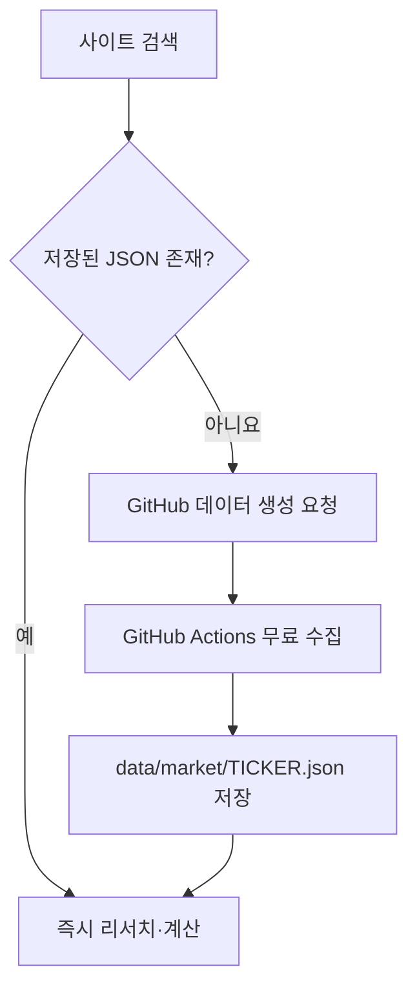

# MyQuantPlatform

유료 시장 데이터 API 키 없이 종목·ETF를 검색하고, 리서치·백테스트·분산 진단·리밸런싱·투자 일지를 한 화면에서 관리하는 GitHub Pages 웹앱입니다.

## 바로 사용하기

1. GitHub Pages에서 `my-portfolio_5.html`을 엽니다.
2. 회사명 또는 티커를 검색합니다.
3. 상세 데이터가 이미 저장된 종목은 즉시 리서치가 열립니다.
4. 처음 보는 티커라면 `무료 데이터 생성 요청`을 누르고 GitHub 이슈를 등록합니다.
5. GitHub Actions와 Pages 반영을 1~3분 기다린 뒤 사이트에서 다시 검색합니다.

API 키 입력, 유료 구독, 로컬 프로그램 설치는 필요하지 않습니다. 한 번 생성된 티커 파일은 검색·백테스트·비교·ETF X-ray에서 반복 사용됩니다.

## 무료 데이터 구조

- 브라우저는 Twelve Data나 FMP 같은 유료 API를 호출하지 않습니다.
- `scripts/build_market_cache.py`가 공개 Nasdaq.com 시장 페이지를 한 번 읽고 정규화된 JSON을 만듭니다.
- `.github/workflows/update-market-data.yml`이 평일마다 기존 캐시를 갱신합니다.
- 일시적인 공급처 오류가 발생해도 기존 정상 캐시 파일은 지우지 않습니다.
- 공개 저장소의 표준 GitHub Actions 실행 시간은 무료지만, GitHub 정책·공급처 페이지 구조는 향후 바뀔 수 있습니다.

## 기본 제공 캐시

다음 28개 티커는 업로드 직후 바로 사용할 수 있습니다.

`AAPL, MSFT, NVDA, GOOGL, AMZN, META, TSLA, AVGO, AMD, PLTR, SPY, VOO, QQQ, QQQM, VTI, VT, IVV, SCHD, SOXX, SOXQ, SMH, XLK, VGT, IWM, DIA, BND, TLT, GLD`

검색용 `data/catalog.json`에는 미국 주식·ETF 약 12,000개가 들어 있으며, 상세 데이터는 필요한 티커만 생성해 저장소 용량을 관리합니다.

## 리서치 데이터

개별 주식에서 제공 가능한 항목:

- 현재가·시가총액·거래량·52주 최고/최저
- PER(최근 제공 4개 분기 EPS 기준), PBR·PSR(최근 연차 기준)
- EPS·ROE·매출총이익률·영업이익률·순이익률
- 총부채·현금 및 단기투자·자산·부채·자본·잉여현금흐름
- 최근 4개년 매출·영업이익·순이익·현금흐름 추이
- 1개월·3개월·6개월·1년 수익률 및 구간 최고/최저
- 애널리스트 평균·상단·하단 목표가와 매수·보유·매도 의견 수
- 회사 설명·섹터·산업·원본 출처·데이터 기준일

ETF에서 제공 가능한 항목:

- 가격·AUM·총보수·배당수익률·변동 관련 정보
- 공개된 상위 보유종목과 각 종목 비중
- 상위 보유종목을 이용한 섹터 노출과 ETF 간 중복률
- 상위 구성의 합계 비중을 표시해 전체 보유종목으로 오인하지 않도록 방지

ETF에는 기업 단위 PER·PBR·ROE가 없는 것이 정상입니다. 공급처가 특정 필드를 제공하지 않으면 앱은 추정하거나 꾸며내지 않고 `-` 또는 `정보 없음`으로 표시합니다.

## 포트폴리오 기능

- 계획 포트폴리오와 실제 보유 포트폴리오 분리
- KRW·USD 통합 평가와 잘못된 통화 단위 손익 차단
- 1·3·5·10년 백테스트와 정확한 날짜 필터
- 변동성·MDD·누적수익률·CAGR·베타·Sharpe·Sortino
- 종목 간 상관관계와 최대 4개 종목 비교
- ETF 상위 구성 기반 실질 노출·섹터 집중·중복 진단
- 추가 투자금·허용오차·수수료·소수점 거래를 반영한 리밸런싱
- 적립식 투자와 일시투자 비교
- 목표자산 도달 보수·기준·낙관 시나리오
- 매수 이유·위험·매도 조건·검토일·날짜별 투자 일지

## 개인 보관함 키

저장 화면에서 키를 입력하면 같은 브라우저 안에 별도의 포트폴리오·메모 공간이 만들어집니다. 같은 키를 다시 입력하면 그 공간을 다시 엽니다.

이 기능은 편의를 위한 로컬 보관함이며 서버 계정이나 진짜 로그인은 아닙니다. 다른 기기와 자동 동기화되지 않으며, 브라우저 데이터를 지우면 사라질 수 있으므로 중요한 기록은 JSON으로 백업해야 합니다.

## 데이터 생성과 수동 갱신

- 사이트에서 처음 보는 티커 검색 → `무료 데이터 생성 요청` → GitHub 이슈 등록
- 또는 GitHub `Actions` → `Update free market data` → `Run workflow` → 티커 입력
- 입력을 비우고 실행하면 이미 저장된 모든 티커를 갱신합니다.

이슈를 통한 생성은 저장소 소유자가 등록한 `[data] TICKER` 요청만 실행되므로 외부 사용자가 수집 작업을 남용할 수 없습니다.

## 데이터 정확도 안내

시장 가격은 공개 페이지의 지연 데이터이며 실시간 주문용이 아닙니다. 재무 수치는 최근 제공된 연차 자료, 애널리스트 값은 의견 집계입니다. 수치마다 기준일과 출처 링크를 표시하며, 이 앱의 결과는 학습·연구용이고 수익을 보장하지 않습니다.
